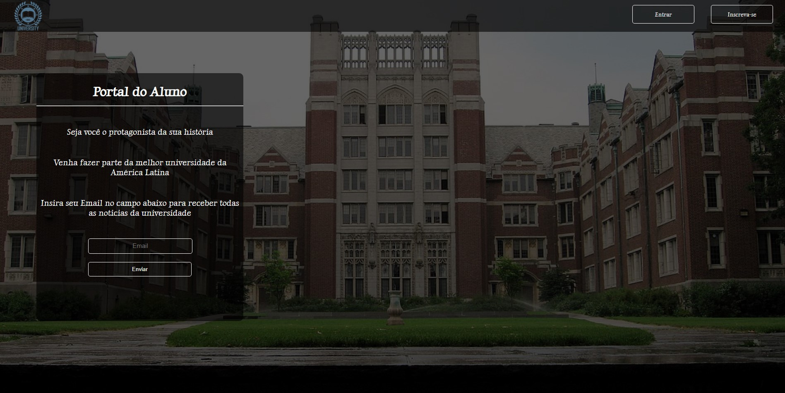
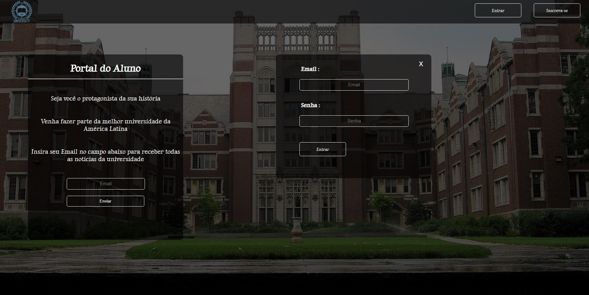
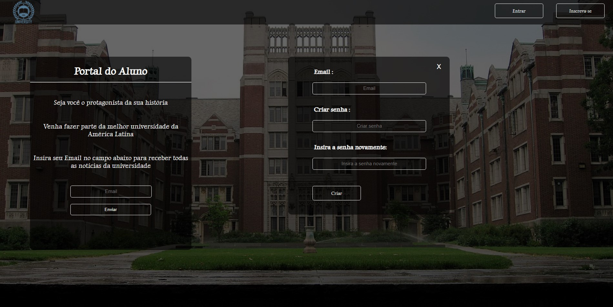

<h1>Portal do Aluno</h1>

Neste projeto é simulado um template de um (Portal do Aluno) de uma universidade.

 

<h3 align='center'>--> [PROJETO README EM ANDAMENTO...] <--</h3>

  

<h2>Abaixo temos o template inicial da página: </h2>

 

<h1 align='center'>
    
</h1>

 

<h2>Em seguida temos o primeiro modal, onde é possível fazer o Login :</h2>

 

Clicando no botão "Entrar" aparece o modal para fazer o Login!

 

<h1 align='center'>
    
<h1>

 

<h2>E por último temos o modal para criar um usuário: </h2>

 

Clicando no botão "Inscrever-se" aparece o modal para criar o usuário!

 

<h1>
    
</h1>

Made with by Diógenes Ribeiro [Visit my Linkedin](https://www.linkedin.com/in/diogenesriboliveira/)